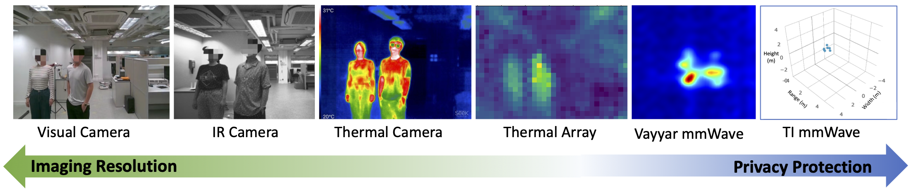
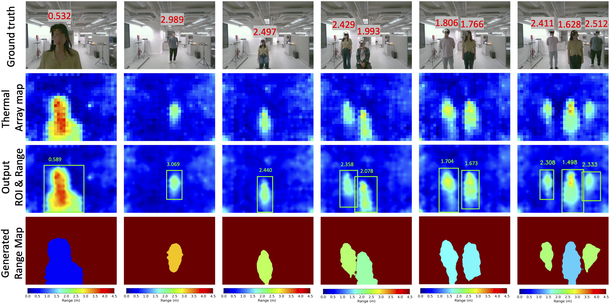

# TADAR

This repository contains the code for the paper:

> TADAR: Thermal Array-based Detection and Ranging for Privacy-Preserving Human Sensing

Modality Comparison. Thermal array sensors strike a balance between imaging resolution and privacy protection for ubiquitous human sensing. The IR image is
from the IR module of the Realsense D455 depth camera. The mmWave imaging is done by a radar with 20 × 20 antennas. The 3D point cloud is generated by TI IWR1843 radar.

We present TADAR, the first Thermal Array-based Detection and Ranging system that estimates the inherently missing range information for multi-user scenarios, extending thermal array outputs from 2D thermal pixels to 3D depths.

The corresponding dataset, including raw data, preprocessed data, and TADAR outputs, are being sorted and will be uploaded soon.
